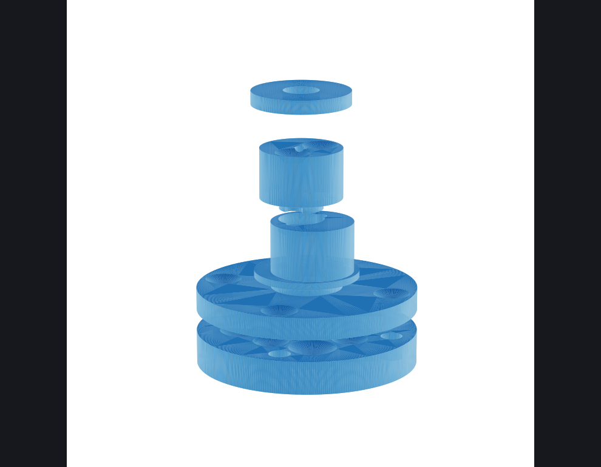

# FAZE4 Digital Twin

A browser-based digital twin for a rebuilt [FAZE4 robotic arm](https://github.com/Source-Robotics/Faze4-Robotic-arm) —
three.js viewer, live joint telemetry, and a print pipeline, all served from one
Python file with no build step.

The arm this drives is a FAZE4 re-actuated with MAD brushless motors (8318/5010),
ODrive S1 drives, and a SAME70 CAN bridge. Arrow keys in the browser nudge the
real motor over Web Bluetooth → RNBD451 → UART → SAME70 → CAN → ODrive, and the
twin follows the *encoder's* reported position — the model moves because the
metal moved, not because we assumed it would.



## What's here

- `viewer/index.html` + `app.js` — the twin: full-arm assembly viewer, per-joint
  sliders, gear-ratio-faithful live mode, BLE teleop (Web Bluetooth), markup
  pins (Shift+click a spot on the model to flag it).
- `viewer/build.html` / `part.html` / `cyclo.html` / `encoder.html` — assembly
  explorer, single-part viewer, cycloidal-drive visualizer, encoder bench page.
- `viewer/serve.py` — static server + slicer/print pipeline (Bambu P1S over
  MQTT/FTPS, FlashForge Adventurer 5M over its LAN API): POST an STL, it
  re-centers, slices with the right profile, uploads, and starts the print with
  a human confirm gate in between.
- `viewer/assets/` — converted meshes for every printed part (stock FAZE4 and
  rebuild parts), plus the upstream assembly instructions as page images.
- `viewer/data/` — the assembly graph and transform data the twin is built from.
- `firmware/` — the SAME70 Zephyr apps: the BLE↔CAN teleop bridge plus bench
  tools (CAN sniffer, standalone cruise test). See `firmware/README.md`.

## Run it

```
python viewer/serve.py
# open http://localhost:8347/viewer/index.html
```

No dependencies for viewing. The print pipeline needs `trimesh`, a slicer
install, and your printer credentials in `viewer/printers_local.json`
(gitignored — see the placeholder block at the top of `serve.py`).

BLE teleop needs the bench hardware (RNBD451 module + SAME70 + ODrive S1) and a
Web-Bluetooth-capable browser.

## Attribution & license

The FAZE4 arm is by Petar Crnjak / [Source Robotics](https://github.com/Source-Robotics/Faze4-Robotic-arm),
licensed **CERN-OHL-S-2.0**. All mesh assets and assembly-instruction images
derived from that project remain under CERN-OHL-S-2.0 — see `LICENSE`.
The viewer/pipeline code in this repo is MIT.
