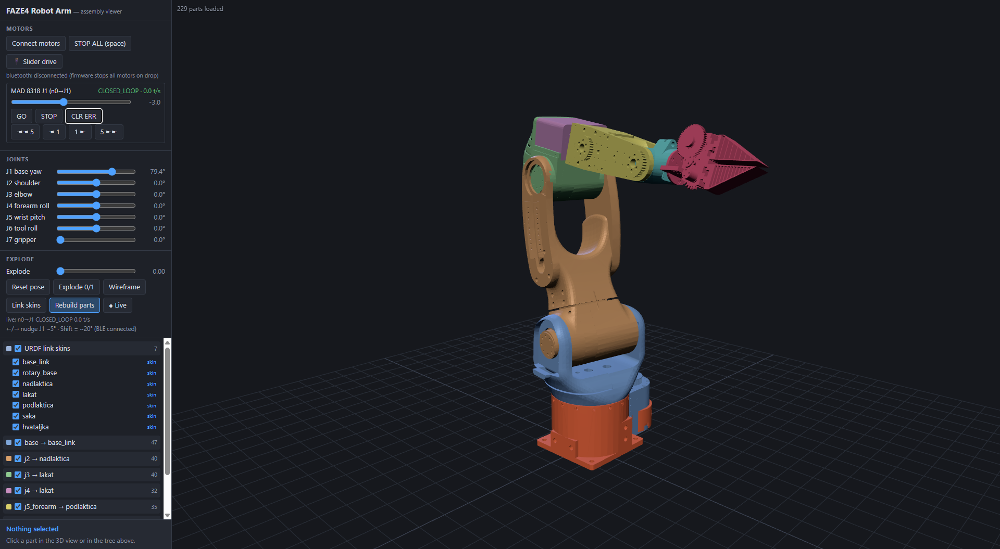
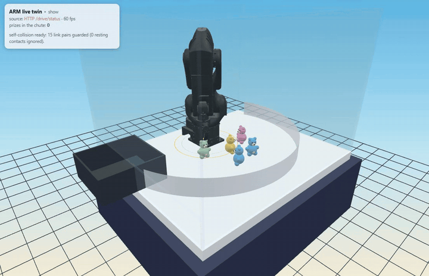
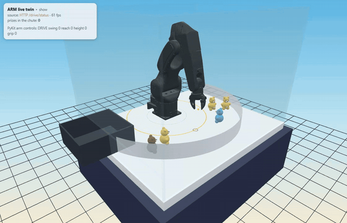
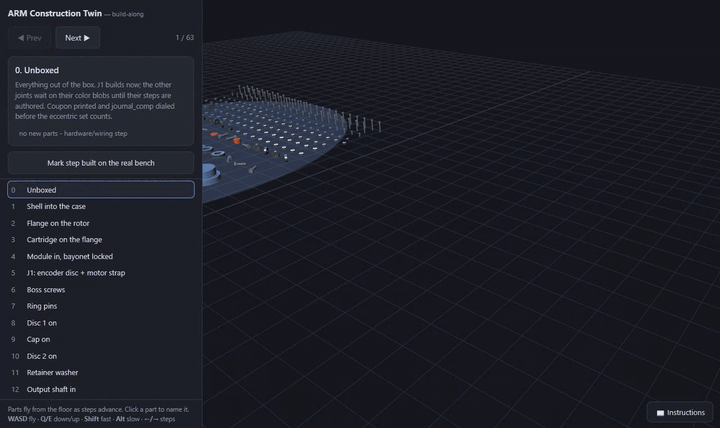
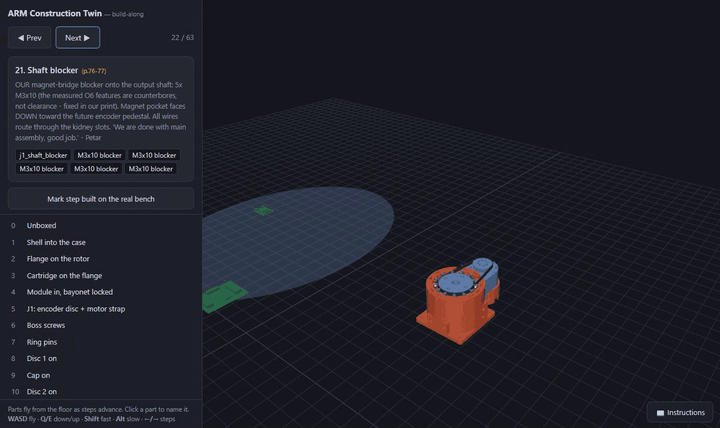
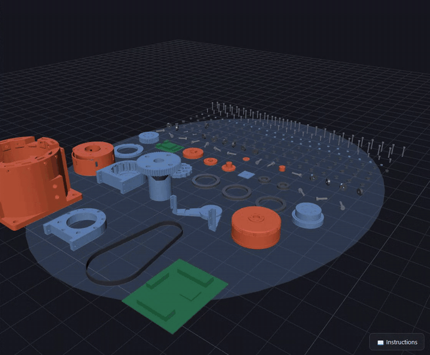

# FAZE4 Digital Twin

A browser-based digital twin for a rebuilt [FAZE4 robotic arm](https://github.com/Source-Robotics/Faze4-Robotic-arm) —
three.js viewer, live joint telemetry, and a print pipeline, all served from one
Python file with no build step.

The arm this drives is a FAZE4 re-actuated with MAD brushless motors (8318/5010),
ODrive S1 drives, and a SAME70 CAN bridge. Arrow keys in the browser nudge the
real motor over Web Bluetooth → RNBD451 → UART → SAME70 → CAN → ODrive, and the
twin follows the *encoder's* reported position — the model moves because the
metal moved, not because we assumed it would.



## What's here

- `viewer/index.html` + `app.js` — the twin: full-arm assembly viewer, per-joint
  sliders, gear-ratio-faithful live mode, BLE teleop (Web Bluetooth), markup
  pins (Shift+click a spot on the model to flag it).
- `viewer/twin.html` — the claw-machine twin: the arm with its SSG-48 gripper in
  the Maker Faire enclosure, claw IK that keeps the gripper pointing down,
  PyKit IMU control over Web Bluetooth, and teddy bears to grab and drop in the
  prize chute (see below).
- `viewer/build.html` — the construction twin: the whole build as 63 steps, parts
  flying from the floor into place, step notes, the upstream instruction pages,
  a bench checklist, and send-a-part-to-the-printer (see below).
- `viewer/part.html` / `cyclo.html` / `encoder.html` — single-part viewer,
  cycloidal-drive visualizer, encoder bench page.
- `viewer/serve.py` — the viewer server, stdlib only. The print pipeline (slice,
  preview, human confirm, send to a Bambu P1S / FlashForge AD5M) runs in the
  full local server, which holds printer credentials and isn't published; on
  this server the print card says no pipeline is available.
- `viewer/assets/` — converted meshes for every printed part (stock FAZE4 and
  rebuild parts), plus the upstream assembly instructions as page images.
- `viewer/data/` — the assembly graph and transform data the twin is built from.
- `firmware/` — the SAME70 Zephyr apps: the BLE↔CAN teleop bridge plus bench
  tools (CAN sniffer, standalone cruise test). See `firmware/README.md`.

## Run it

```
python viewer/serve.py
```

That's it — it opens the viewer in your browser by itself
(`--no-browser` to suppress, `--host 0.0.0.0` for network use).

No dependencies, no configuration, no accounts — stdlib Python only.

BLE teleop needs the bench hardware (RNBD451 module + SAME70 + ODrive S1) and a
Web-Bluetooth-capable browser.

## Claw-machine twin

`viewer/twin.html` puts the arm in the claw-machine enclosure it runs in at
Maker Faire. Grab a teddy bear, carry it over the chute, open the claw, and it
counts as a prize.



It takes the same PyKit commands as the real arm. The PyKit sends
`$seq,pitch,roll,yaw,g,gx,gy,gz,mode,swing,reach,height,grip` lines, and the twin
reads the mode fields like the SAME70 does:

| PyKit | Claw |
|---|---|
| double-tap D3 | enter / leave control (first entry goes to the ready point) |
| tilt left / right | swing around the base |
| hold D3 + tilt | up / down |
| hold D5 + tilt | out / in |
| double-tap D5 | close / open |
| hold D3 + D5 | glide back to the ready point |



To run it: start `python viewer/serve.py`, open
`http://localhost:8347/viewer/twin.html` in Chrome or Edge (Web Bluetooth),
click **Connect PyKit (BLE)** and pick the PyKit (`CLIFF_ARM` or `PYKIT_IMU`).
Without a PyKit, the on-screen jog buttons, **GRAB** and **HOME** drive it too.
Moves the IK can't make safely (out of reach, self-collision, into the floor)
are refused and the claw stays put. **frame** hides the enclosure's corner bars,
and clicking the panel title collapses it.

For scripting, `window.twin.feed(line)` takes the same PyKit lines from the
browser console; the GIFs above were recorded that way.

## Construction twin

`viewer/build.html` walks the rebuild in 63 steps, from the J1 base through
J2–J5 to the gripper. **Next** / **Prev** (or ←/→) moves between steps; each
step's parts fly from their joint's pile on the floor to where they go, and the
step card lists them with the build notes and a link to the matching page of
the upstream instructions (**Instructions** opens the page viewer).





Click a part to name it; right-click (or Ctrl+click) hides it, **H** brings
everything back. **Mark step built on the real bench** keeps a checklist of how
far the physical arm has got. WASD / Q / E fly the camera.

Clicking a printable part also opens a print card: pick the printer and the
material, and the full local server slices it, shows the plate and the time
estimate, and waits for **Print it** before anything reaches the printer. This
recording stops at **Cancel**:



`window.build` exposes the camera, the parts (with their step and assembled
position) and `go(n)` for scripting; the GIFs were recorded headless with it.

## Run it on a Raspberry Pi (or any always-on box)

```
git clone https://github.com/Clifford-Swartz/faze4-digital-twin.git
cd faze4-digital-twin
python3 viewer/serve.py --host 0.0.0.0
# open http://<pi-address>:8347/viewer/index.html from any device on your network
```

To start it on boot, a minimal systemd unit
(`/etc/systemd/system/faze4-twin.service`):

```ini
[Unit]
Description=FAZE4 digital twin
After=network.target

[Service]
ExecStart=/usr/bin/python3 /home/pi/faze4-digital-twin/viewer/serve.py --host 0.0.0.0 --no-browser
Restart=on-failure

[Install]
WantedBy=multi-user.target
```

then `sudo systemctl enable --now faze4-twin`.

Note: Web Bluetooth requires a secure context, so the BLE teleop button only
works on `localhost` or over HTTPS — viewing and the assembly explorer work
fine from any device either way.

## Attribution & license

The FAZE4 arm is by Petar Crnjak / [Source Robotics](https://github.com/Source-Robotics/Faze4-Robotic-arm),
licensed **CERN-OHL-S-2.0**. All mesh assets and assembly-instruction images
derived from that project remain under CERN-OHL-S-2.0 — see `LICENSE`.
The gripper meshes in `cad/gripper/` are derived from Source Robotics' SSG-48
gripper and stay under that project's license.
The viewer/pipeline code in this repo is MIT.
